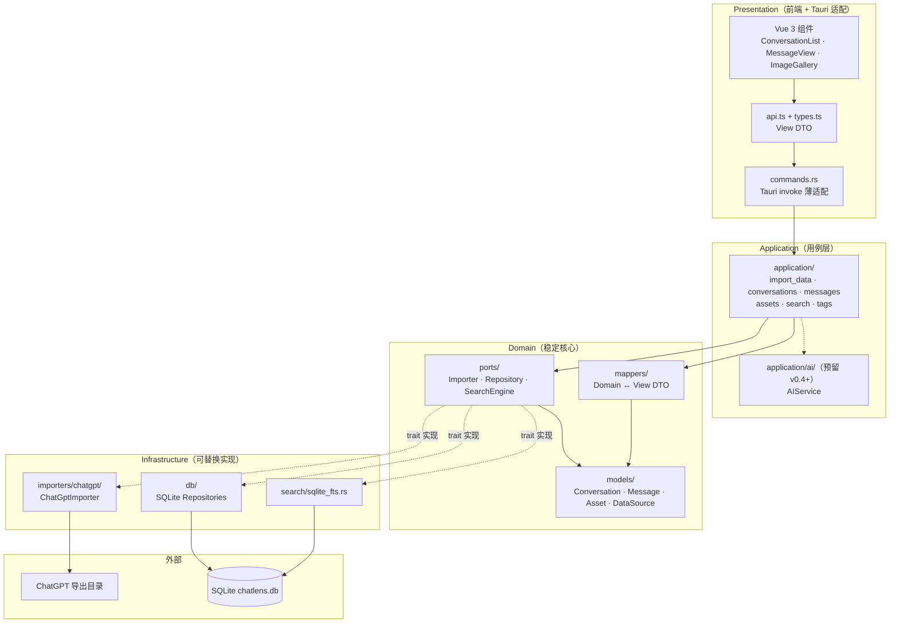
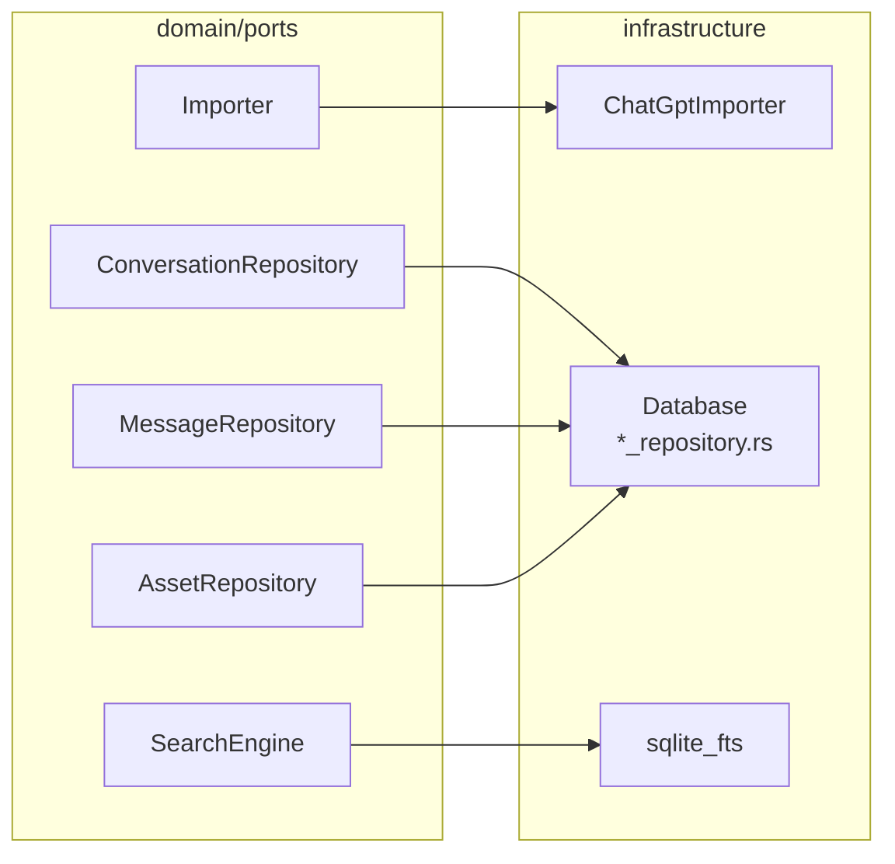
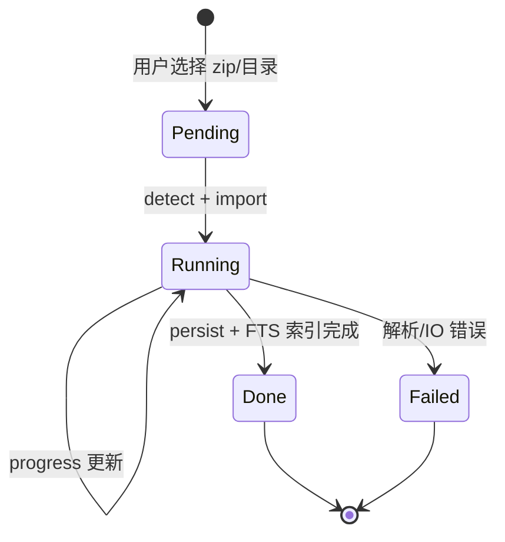
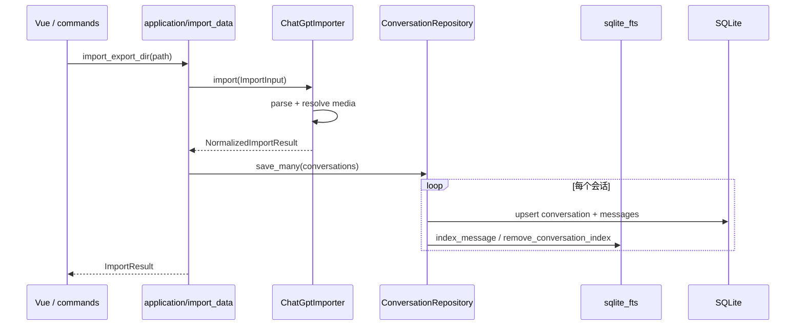
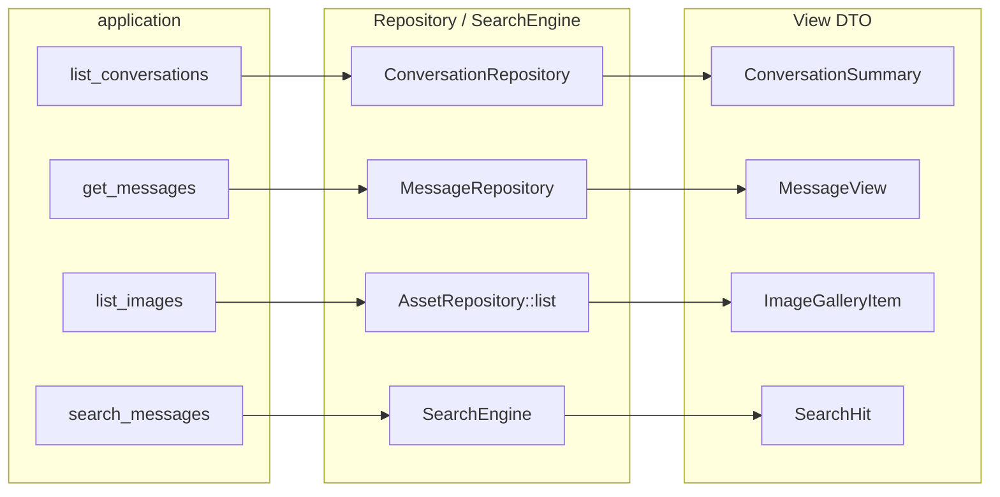

# ChatLens 架构说明

> 本文描述 **架构收敛（PR 1–5）完成后的当前结构**。技术路线与版本规划见 [ROADMAP.md](../ROADMAP.md)。
>
> **当前阶段**：v0.3 已完成；**v0.4** 为多源 Importer（PR4a–c）+ 多源 UI（PR4d）；智能分析延后至 **v0.5**。见 [ROADMAP.md](../ROADMAP.md)。

## 核心原则

> **外部数据源可以变，内部模型尽量稳定。**

核心层只认：

```text
Conversation · Message · Asset
Importer · Repository · SearchEngine
```

以下概念 **不得渗入** `domain/` 与 `application/` 的用例编排：

| 禁止进入核心层 | 应留在 |
|----------------|--------|
| ChatGPT `mapping` / `current_node` | `infrastructure/importers/chatgpt/` |
| Cursor / Claude / Gemini 导出字段 | 对应 Importer 实现 |
| FTS5 SQL、`messages_fts MATCH` | `infrastructure/search/` |
| SQLite 表结构细节 | `infrastructure/db/` |
| OpenAI / DeepSeek response 格式 | `application/ai/`（预留） |

演进规则：

| 变化类型 | 改哪里 |
|----------|--------|
| 外部导出格式 | Importer |
| 存储后端 | Repository |
| 搜索能力（向量、混合检索） | SearchEngine |
| LLM 总结 / 打标签 / 嵌入 | `application/ai/`（非 domain port） |

---

## 总体分层



**依赖方向**：`Presentation → Application → Domain ← Infrastructure`

Domain 不依赖具体 JSON 格式、SQL、FTS 或 LLM API。

---

## 设计决策记录

### AI 放在 application 而非 domain

`Conversation` / `Message` / `Asset` 是长期稳定的核心；LLM 供应商与 API 形态变化快。因此：

- **不**在 `domain/ports/` 定义 `AIProvider` trait（至少 v0.4 之前）
- AI 能力通过 `application/ai/` 编排，调用外部 API 或本地模型
- 若未来需跨端复用 AI 逻辑，再评估是否下沉为 port

### ImportJob：轻量本地 job，非任务平台

v0.3 的 `ImportJob` 目标：

```text
id · source_path · status · progress · processed · total · error
```

用于 zip 解压、大目录解析时的**进度条与失败提示**。不做：分布式队列、失败自动重试调度、多 worker。

### AssetType 已预留

`domain/models/asset.rs` 中 `AssetType` 已包含：

```text
Image · File · Code · Prompt · Link
```

`Document` 等类型待真实导出格式出现后再补，不必提前空转。

---

## 端口（Ports）与当前实现



| 端口 | 职责 | Trait 定义 | 当前实现 |
|------|------|------------|----------|
| `Importer` | `detect` / `preview` / `import` → 统一导入包 | `domain/ports/importer.rs` | `ImporterRegistry` → `infrastructure/importers/*` |
| `ConversationRepository` | 会话列表、收藏、标签、导出、导入写入 | `domain/ports/repository.rs` | `infrastructure/db/conversation_repository.rs` |
| `MessageRepository` | 消息列表、消息收藏 | 同上 | `infrastructure/db/message_repository.rs` |
| `AssetRepository` | 资产列表（图片画廊）、按来源统计 | 同上 | `infrastructure/db/asset_repository.rs` |
| `SearchEngine` | 全文搜索；导入时 FTS 索引 | `domain/ports/search_engine.rs` | `infrastructure/search/sqlite_fts.rs` |

| 能力（非 domain port） | 职责 | 位置 | 状态 |
|------------------------|------|------|------|
| AIService | 总结、打标签、抽资产、嵌入 | `application/ai/` | 未实现（v0.4+） |

---

## 领域模型

Rust `domain/models/` 为 **source of truth**。经 `commands` 序列化给前端前，通过 `domain/mappers/` 转为 View DTO。

| 模型 | 要点 |
|------|------|
| `Conversation` | `source`、`sourceId`、`title`、时间、计数、`isFavorite`、标签、`importPath` |
| `Message` | `role`、`content: MessageContent[]`、`plainText`、`assetIds`、`rawRef` |
| `Asset` | 统一图片 / 文件 / 代码 / 链接等；`assetType`、`localPath`、`metadata` |
| `DataSource` | `ChatGpt` · `Cursor` · `Claude` · `Gemini` |
| `SearchQuery` / `SearchResult` | 搜索抽象，与 FTS 解耦 |
| `ImportJob` | 已实现：内存 registry + `import_jobs` 表持久化；`start_import` 后台线程 + 事件 |
| `SourceInfo` | 已实现：写入 `imports` 与 `import_jobs` |

`MessageContent` 当前版本：

```rust
Text { text }
ImageRef { asset_id }
```

收藏在 domain 层用 `is_favorite`；DB 列仍为 `is_starred`，mapper 转换。

---

## 数据演进

### meta 表与 schema_version（v1，已实现）

`meta` 表在 `Database::open` 时创建；`infrastructure/db/migration.rs` 按版本号顺序执行迁移。

| key | 示例 value | 用途 |
|-----|------------|------|
| `schema_version` | `4` | 驱动有序迁移（当前 `CURRENT_SCHEMA_VERSION = 4`） |
| `app_version` | `0.1.0` | 最近一次打开数据库的应用版本（`CARGO_PKG_VERSION`） |

v1 迁移：将早期库中散落的 `ALTER TABLE`（`is_starred`、`attachments`）纳入版本框架。

v2 迁移：`import_jobs` 表；`imports` 表增加 `source` / `export_label` / `importer_version`。

v3 迁移：`conversations.source` / `conversations.source_id`；旧数据回填为 `chatgpt` + `id`。

v4 迁移：会话主键改为 `{source}::{source_id}`；级联更新 `messages` / `conversation_tags`，并重建 `messages_fts`。

### conversations.source / source_id（v3–v4）

domain 模型已有 `source` / `sourceId`。v3 补齐 DB 列；v4 起库内 `conversations.id` = `{source}::{source_id}`，Importer 仍只产出平台侧 `source_id`，复合 ID 在持久化层生成。

导入时记录来源元数据，便于多包合并与调试：

```text
source:           chatgpt
export_label:     2026-06-export
importer_version: 0.3
```

可挂在 `imports` 表扩展字段或 `ImportJob` 结果中，写入 `NormalizedImportResult`。

### SourceInfo（v0.3）

- **包内去重**：`domain/import_merge.rs` 按对话 `id` 合并，消息按源 `message.id` 去重。
- **跨包合并**：持久化时不再 `DELETE` 全量消息，改为按 `conversation_id::message_id` upsert，保留其他导出包中的独有消息。
- **元数据**：较新的 `update_time` 优先更新标题/模型；`message_count` 与 FTS 在合并后重建。

### ImporterRegistry（v4 PR4a，已实现）

- `infrastructure/importers/registry.rs`：`detect(path)` / `find_export_root(path)`，按注册顺序匹配。
- `application/import_data` 与 `archive/zip_import` 经 registry 选择 Importer，不再硬编码 `ChatGptImporter`。
- 新源接入：实现 `Importer` trait 并加入 `default_importer_registry()` 即可。

### CursorImporter（v4 PR4b，已实现）

- 读取 Cursor 本地 `globalStorage/state.vscdb`（只读 `immutable=1`），解析 `composerData:*` 与 `bubbleId:{composerId}:*`。
- 支持导入路径：`state.vscdb` 文件、`globalStorage` 目录、或 `Cursor/User` 目录。
- 会话标题来自 `composer.composerHeaders`（Cursor 3.0+）或 `composerData` 内嵌元数据；消息按 `fullConversationHeadersOnly` 顺序还原。

## 导入生命周期（v0.3 规划）



```text
用户选择路径
    → application/import_data 创建 ImportJob
    → Importer.detect / preview / import
    → Repository.save_many + SearchEngine.index
    → ImportJob.status = Done | Failed
    → UI 展示进度与 ImportResult
```

大文件 / zip 场景下，`ImportJob` 是产品功能（进度条）与技术状态（可恢复诊断）的交汇点。

---

## View DTO（API 契约）

`src-tauri/src/models.rs` 与前端 `src/types.ts` 对齐，**保持稳定**，不直接暴露 domain 类型：

| View DTO | 用途 |
|----------|------|
| `ConversationSummary` | 对话列表 |
| `MessageView` | 消息浏览（含 `AttachmentView`） |
| `ImageGalleryItem` | 图片画廊（由 `Asset` 投影） |
| `SearchHit` | 搜索结果（由 `SearchResult` 投影） |
| `TagView` | 标签 |
| `ImportResult` | 导入结果 |

双轨策略：domain 与 DTO 并存，逐步把仓储/用例内部改为 domain 类型，边界处再映射。

---

## 目录结构

```text
src-tauri/src/
├── commands.rs                 # Tauri invoke 入口
├── application/                # 用例编排
│   ├── import_data.rs
│   ├── conversations.rs
│   ├── messages.rs
│   ├── assets.rs
│   ├── search.rs
│   ├── tags.rs
│   └── ai/                     # 预留（v0.4+）
├── domain/
│   ├── models/                 # Conversation, Message, Asset, …
│   ├── ports/                  # Importer, Repository, SearchEngine
│   └── mappers/                # Domain ↔ View DTO
├── infrastructure/
│   ├── importers/chatgpt/      # 解析、媒体、ChatGptImporter
│   ├── importers/cursor/       # state.vscdb 解析、CursorImporter
│   ├── db/                     # SQLite + *_repository.rs
│   ├── search/                 # sqlite_fts.rs
│   └── media/                  # 导出目录媒体索引
├── models.rs                   # View DTO
└── db/mod.rs                   # re-export Database

src/                            # Vue 前端（薄层）
├── api.ts
├── types.ts
└── components/
```

前端不拆 `presentation/` / `domain/` 子目录；`api.ts` + `components/` 足够。

---

## 数据流

### 导入（当前）



v0.3 在导入流程中通过 `start_import` → 后台线程 → `import-progress` / `import-complete` 事件推送进度；zip 由 `infrastructure/archive/zip_import.rs` 解压（含嵌套 zip）。

### 读取与搜索



---

## 架构收敛（已完成）

| PR | 内容 | 状态 |
|----|------|------|
| PR 1 | 领域模型 + mapper | ✅ |
| PR 2 | ChatGPT Importer | ✅ |
| PR 3 | Repository 拆分 + application 层 | ✅ |
| PR 4 | SearchEngine trait + sqlite_fts | ✅ |
| PR 5 | Asset 统一（`AssetRepository::list`） | ✅ |

后续架构变更遵循 [ROADMAP.md](../ROADMAP.md)「架构维护原则」：新格式 → Importer，新存储 → Repository，新检索 → SearchEngine。

---

## 远期愿景：Indexer（v0.5+）

导入完成后可能需要重建多种索引：

```text
FTS · Thumbnail · Embedding · Summary
```

若种类增多，可评估 `Indexer` 编排层（`rebuild(conversation_id)`），与 `SearchEngine` 分工：

| 组件 | 职责 |
|------|------|
| `SearchEngine` | 查询侧抽象（FTS、未来向量检索） |
| `Indexer` | 写入侧编排（导入后触发各类索引构建） |

当前仅 FTS 由 `SearchEngine` 在导入时同步写入，**暂不引入** `Indexer` trait。

---

## 暂不过度设计

以下只在架构上 **留位置或文档愿景**，当前不实现：

- 插件化 Importer 动态加载
- 服务端 / 多端同步
- 向量数据库、Hybrid 搜索
- LLM API 配置中心
- 分布式 / 可重试的完整 ImportJob 任务平台
- `Indexer` 编排层（v0.5+ 再评估）
- 前端完整 Clean Architecture 目录

---

## 相关文档

- [ROADMAP.md](../ROADMAP.md) — 技术栈、版本规划、数据库表设计、v0.4 当前重点
